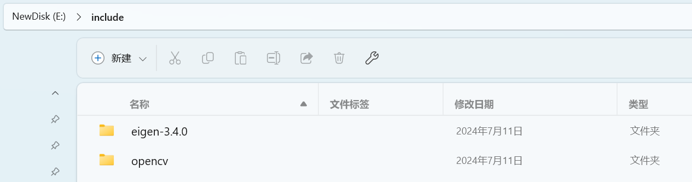
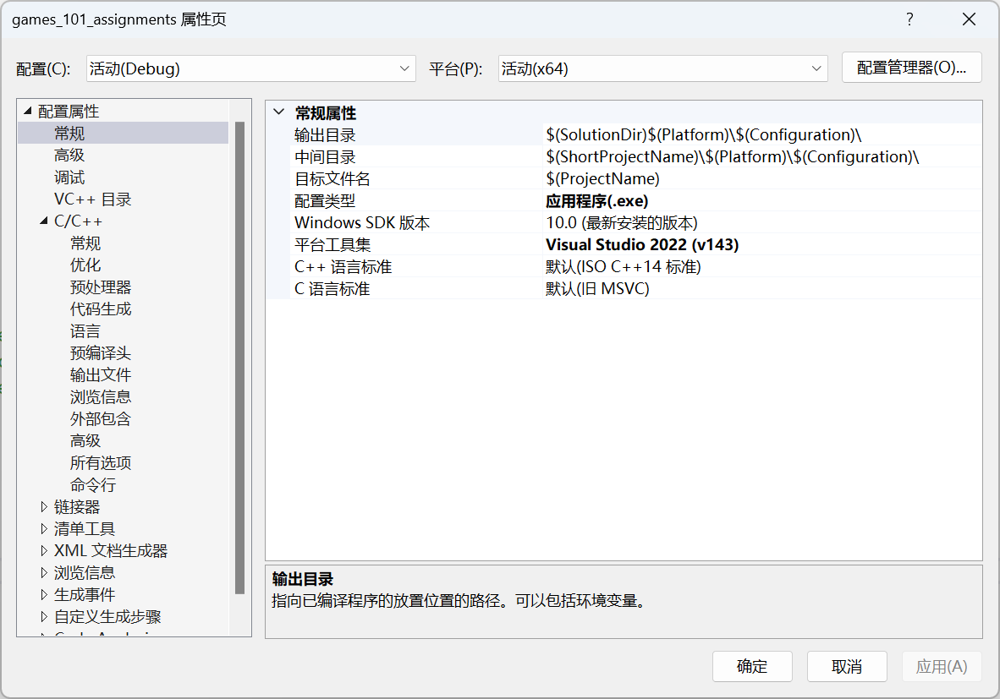
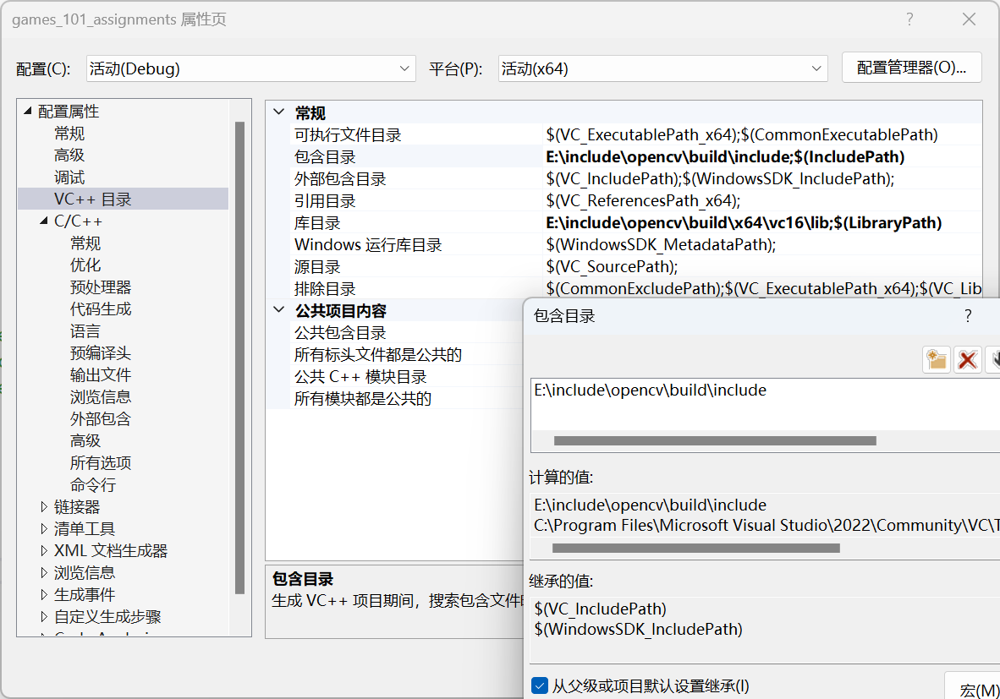
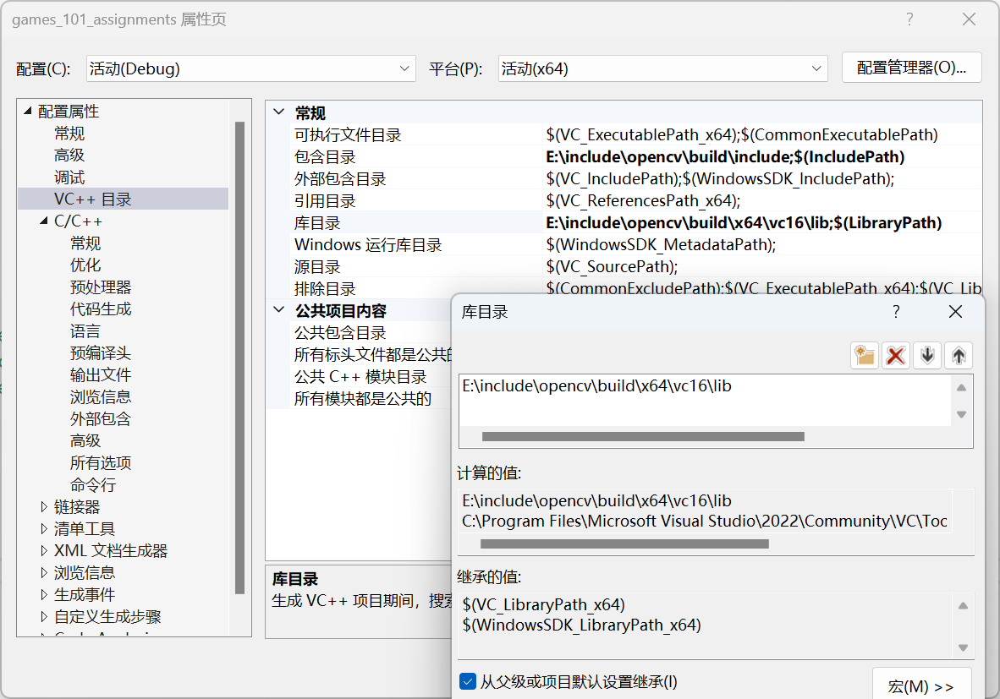
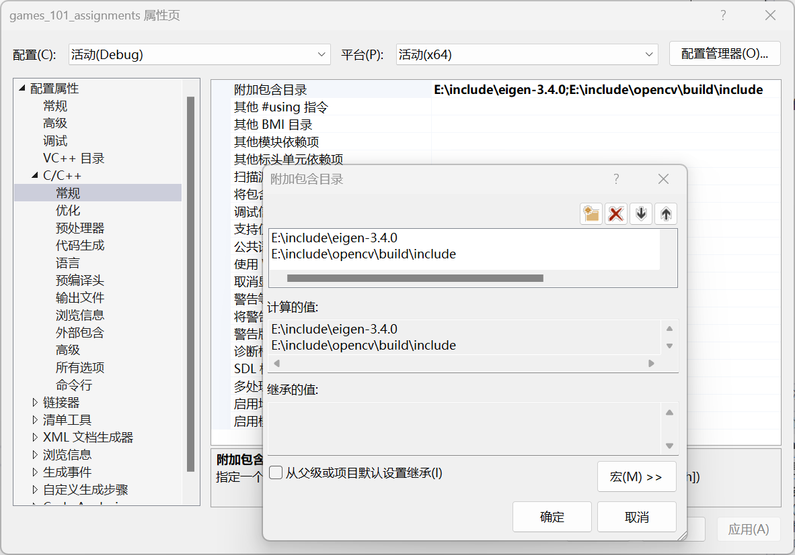

# 环境配置

开发环境：win11 & vs2022

本人捣鼓不明白CMake，直接上vs。

## 1. 下载Eigen和OpenCV库

放在任意便于管理的目录下

## 2. 修改visual studio配置

项目 --> <项目名>和属性

在属性页导航到以下页面进行更改

1. 常规 --> C++语言标准

    选C++ 17以上

2. VC++ 目录

    --> 包含目录

    

    --> 库目录

    

3. C/C++ --> 常规 --> 附加包含目录

    
